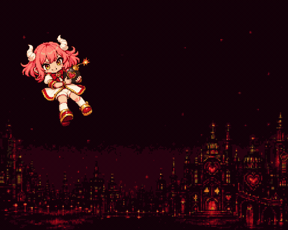
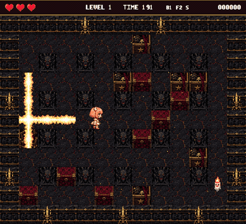

# Bomb Bomb Hell!

A Bomberman-style game set in hell, starring a cute demon girl who throws bombs with hearts on them. One HTML file, no build step, plays in any browser.

**Play it now: https://isabellagreco1997.github.io/bomb-bomb-hell/**

<p align="center">
  
  
</p>

## How to play

| key | action |
|---|---|
| arrow keys | move |
| E | drop a bomb (also selects in the menu) |
| Enter / Space | select |

Break the crates, catch the candle ghosts in your blast (two hits each), find the power-up and the exit hidden under the crates, and get out before the timer runs out. When it does, more ghosts arrive. From level 2 the ghosts spit fire at you when you stand in their line. Five levels, each bigger than the last, then you escape hell.

## What is in it

- 5 levels, from a single screen to 27x17 tiles, with a camera that follows you
- power-ups: extra bomb, fire range, speed, one hidden per level, permanent
- an exit hidden under a crate; bomb it once revealed and enemies pour out, like the 1985 original
- a timer per level that summons enemies at zero, score, three hearts, an extra heart per level
- a heroine with real walk cycles in four directions, a breathing idle, a start pose, a death and a win animation, all sampled from generated video
- a candle ghost with its own loop, a spit attack with a tell, hurt and dying states
- 90+ voice lines (she comments on everything), fuse ticks, blasts, footsteps, a level-clear jingle, a game-over sting
- a lava floor that pulses, demon statues whose eyes flare, candelabras on the walls, embers
- `?showcase=1` plays a scripted round that triggers every sound in order
- `?bot=1` lets a rule-abiding bot play the game by itself, useful for testing balance

## Use this as a starting point for your own AI-built game

This whole game was built in a few days by one person directing AI agents, and it is meant to be forked and pushed further. Everything you need to continue with your own agent is here:

- `index.html` is the entire game: world, entities, drawing, sounds, levels, the bot and the showcase are all in one readable script.
- `CLAUDE.md` briefs an AI agent on how the project is organised, how the assets were made, and the rules we learned the hard way. Point your agent at it and ask for a new enemy, a new level, a power-up, a boss.
- `tools/` holds the asset pipeline: cut sprites from AI-generated sheets and videos, build walk cycles from reference footage, cut voice lines from a single recording, pack the atlas. Re-run it with your own generated art and voices.
- `assets/src/` keeps the raw generated sheets and reference material so you can see where every sprite came from.

Some ideas to hand your agent: a second enemy type from the enemies sheet, breakable walls that drop coins, a two-player battle mode on one keyboard, touch controls for phones, a boss on level 5, a level editor.

## How it was made

- **Art:** sprite sheets generated from prompts, then cut, keyed and quantised with [sprite-forge](https://github.com/isabellagreco1997/sprite-forge). Walk cycles, idle, death and win animations were sampled from short generated videos of the character, because generated sprite sheets do not actually animate. The title screen art was redrawn by hand as a layered pixel scene.
- **Voice and sound effects:** generated with ElevenLabs (voice lines and the sound-effects tool), then sped up 1.3x with the pitch so she sounds like herself but tiny.
- **Music:** generated with Suno.

## Run it locally

Any static server works, for example:

```
python3 -m http.server 8000
```

then open http://localhost:8000/. Opening `index.html` straight from disk will not load the atlas, browsers block that.

## Licence

MIT. The generated art, voices and music are included under the same terms; credit is appreciated.
